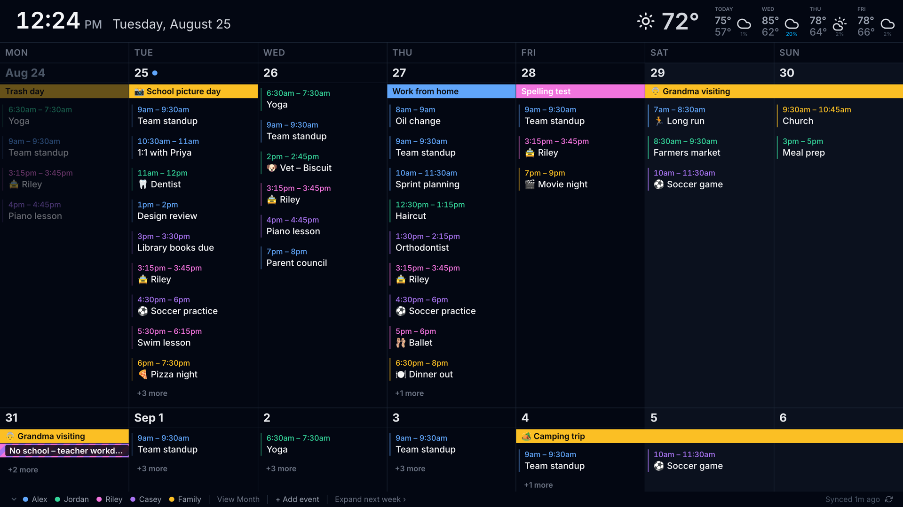
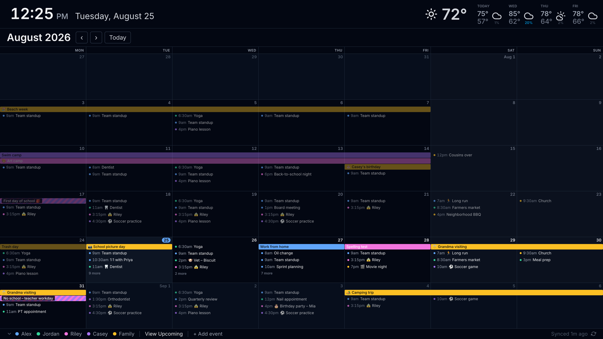
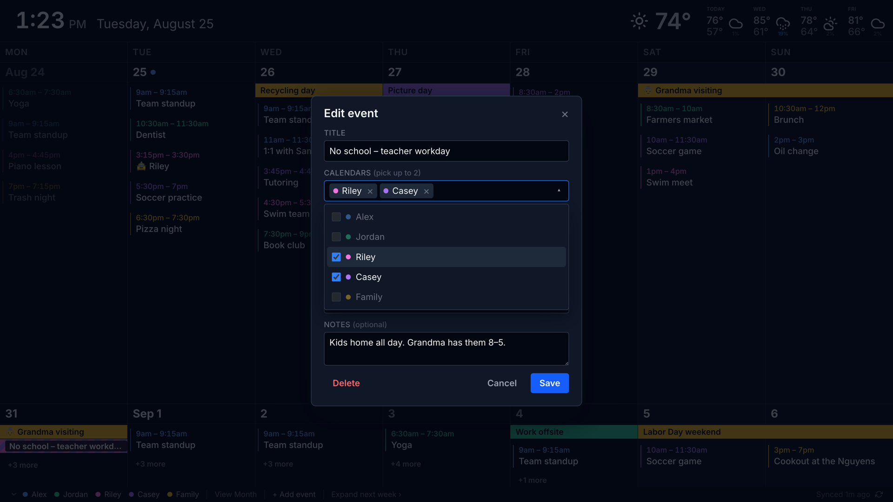
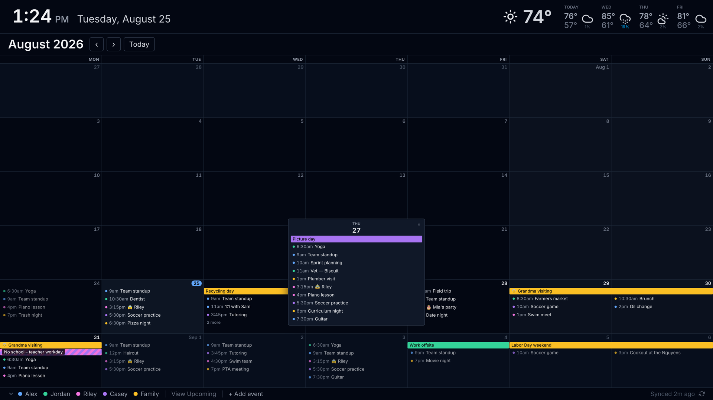

# HomeHQ

A self-hosted family calendar for the screens around your house. Google Calendar in, a dense dark-theme dashboard out, running on a Raspberry Pi in the kitchen and a touch panel in each kid's room.

[](https://github.com/jaredatch/homehq/actions/workflows/ci.yml)
[](LICENSE)
[](https://nodejs.org/)
[](https://nextjs.org/)



## Why

We ran Dakboard on the kitchen wall for years. It's fine, but on a busy school week it crops half the day behind "+6 more" and there's no way to get them back. HomeHQ started as "fit more events on the screen" and grew into the calendar we actually wanted: one that reads from across the room, that the kids can glance at, and that a parent can add a dentist appointment to without pulling out a phone.

Then the kids wanted their own. One install now drives every screen in the house off the same database and the same Google connection: the kitchen wall, and a touch panel by a bed showing one person's day.

It's built for one household on one Google account, and that's the whole scope. There's no multi-tenant anything and no widget system.

## What it does

- **Two weeks at a glance**, full width, with all-day events as spanning bars and timed events stacked beneath. The grid measures every event's real height and packs each day with as many as fit.
- **Expand next week** when you need the detail, and it snaps back on its own.
- **Month view** for scrubbing ahead (a school email listing fall-break dates, seven months out), with a day popover, keyboard paging, and the same auto-revert.
- **Add, edit, and delete events** from the wall, straight into Google Calendar. This is opt-in; the default is a read-only display.
- **One event on two people's calendars** shows as a single two-colour chip, whether HomeHQ created it, Google linked it as an invite, or someone typed it in twice.
- **Per-person filter** from the legend. Click a name to see just their week.
- **Icons instead of the words you type every week.** `Dropoff Alex` draws as a car and the name, `Dentist Appt` as a clock and `Dentist`. Rules live in config and the icon can take the person's own colour.
- **A screen per person.** The kitchen wall is one board; a 10" touch panel in a bedroom is another, showing that kid's day, her own private calendar, and her to-dos. Same install, same sync, its own PIN.
- **To-dos from Todoist** on a personal board, ticked off with a finger and written back.
- **Clock and weather** in a slim top bar. Weather from Open-Meteo, no API key needed.
- **Made for an always-on screen.** Every transient state reverts after idle. Cached data stays up through any outage. A deploy refreshes the kiosk by itself.
- **Renders on a bare Raspberry Pi.** Self-hosted emoji font and SVG weather icons, because a stock Pi image has neither.

Auth is a six-digit PIN behind a signed cookie that renews itself, so no kiosk ever logs out. The household PIN opens every screen; a board can also have its own, which opens only that screen.

## Screenshots

Month view. A sit-down view for looking further ahead; it goes back to the week grid on its own.



Editing a shared event. One event on two calendars, with the calendar picker open.



A full day in month view. "N more" opens the whole list without leaving the grid.



## How it works

Next.js 16 with a SQLite cache in the middle. Background jobs pull from Google Calendar (every 5 min), Open-Meteo (every 30 min), and Todoist (every minute) into `data/homehq.db`; every screen polls API routes that read from that cache. The browser never talks to Google, credentials never leave the server, and a Google outage just means the wall keeps showing what it had.

Extra screens are config, not code. A board is an override layer over the top-level settings, so an install with no `boards` key behaves exactly as it did before boards existed.

Details in [docs/architecture.md](docs/architecture.md). The calendar layout has its own write-up in [docs/calendar.md](docs/calendar.md).

## Quick start

You need Node 24 and a Google Cloud project with the Calendar API enabled ([walkthrough](docs/google-oauth-setup.md), about ten minutes).

```bash
git clone https://github.com/jaredatch/homehq.git
cd homehq
npm install

cp .env.example .env                              # add Google client ID/secret, a cookie secret
cp data/config.example.json data/config.json      # calendars, lat/long, PIN

npm run dev
```

Open [http://localhost:3000](http://localhost:3000), enter your PIN, then visit `/setup` to connect Google. Events show up within a few minutes; weather within a minute. That's the kitchen wall; adding a board for another screen is a `boards` block in the same file.

Every config key is documented in [docs/configuration.md](docs/configuration.md). Local development and troubleshooting are in [BOOTSTRAP.md](BOOTSTRAP.md).

## Running it on a wall

[docs/deployment.md](docs/deployment.md) covers the whole thing: a $6 VPS behind nginx (with or without Cloudflare), a systemd unit, daily backups, and a Raspberry Pi in Chromium kiosk mode driving a 4K panel. It's written generically; our own instance is one droplet driving a Pi 5 on the kitchen wall and a small panel in each kid's room.

## Docs

| Doc                                                      | What's in it                                          |
| -------------------------------------------------------- | ----------------------------------------------------- |
| [docs/configuration.md](docs/configuration.md)           | Every `config.json` and `.env` key, with defaults     |
| [docs/google-oauth-setup.md](docs/google-oauth-setup.md) | Google Cloud project, consent screen, credentials     |
| [docs/deployment.md](docs/deployment.md)                 | Server, TLS, backups, Raspberry Pi kiosk              |
| [docs/architecture.md](docs/architecture.md)             | Sync, cache, auth, writes, shared events, self-update |
| [docs/calendar.md](docs/calendar.md)                     | How the grid lays out, crops, and reverts, and why    |
| [BOOTSTRAP.md](BOOTSTRAP.md)                             | Dev setup, commands, troubleshooting                  |
| [CONTRIBUTING.md](CONTRIBUTING.md)                       | How to send a change                                  |

## Contributing

Bug reports and small, focused pull requests are welcome. Read [CONTRIBUTING.md](CONTRIBUTING.md) first; the calendar grid has a couple of invariants that are easy to break by accident.

## License

[MIT](LICENSE). The bundled Noto Color Emoji font is under the [SIL Open Font License](public/fonts/emoji/LICENSE.txt).
Event-title icons come from [Font Awesome Free](https://fontawesome.com/), whose icons are [CC BY 4.0](https://fontawesome.com/license/free).
